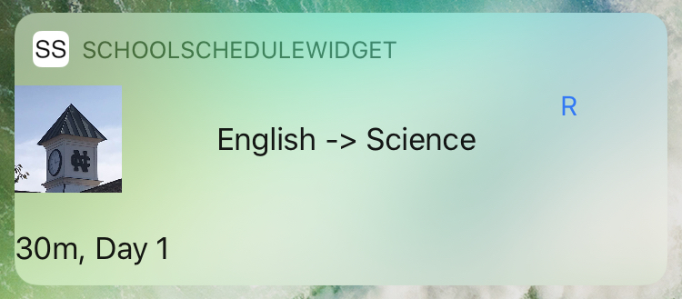

# SchoolSchedule

An app the provides a widget and notification subscriber to stay up to date with a school schedule. *The widget will not work on ios 14 as it was created for the old widget system however, it would not be hard to update the code.*
## Setup
Upon opening the app the user may tap left and right to start configuring their schedule. The first page will allow the user to automatically configure an 8-day schedule. The following pages may be used to set the name, description and add an icon to each class. Next the order and time of classes may be set within the table view. Once fully setup notifications will be scheduled and the widget will be setup.
## Notifications
User notifications are scheduled inside of the App Delegate after a background fetch is called. The fetch determines if there are any classes on the current day and if so it it retrieves all classes from the Core Data Stack where they are stored. The data is then predicated to find the right classes and then sorted in order of time. Next the notification is created and configured with the correct properties and trigger date and then added to the Notification Center. 
## Widget
The Widget displays the current class, the time till the end of that class, the next class and an icon. The widget will attempt to update itself automatically however there are limits to when Apple allows fetching data. There is a blue refresh button that is availible to the user that may be used to refresh all labels within the widget if needed.
